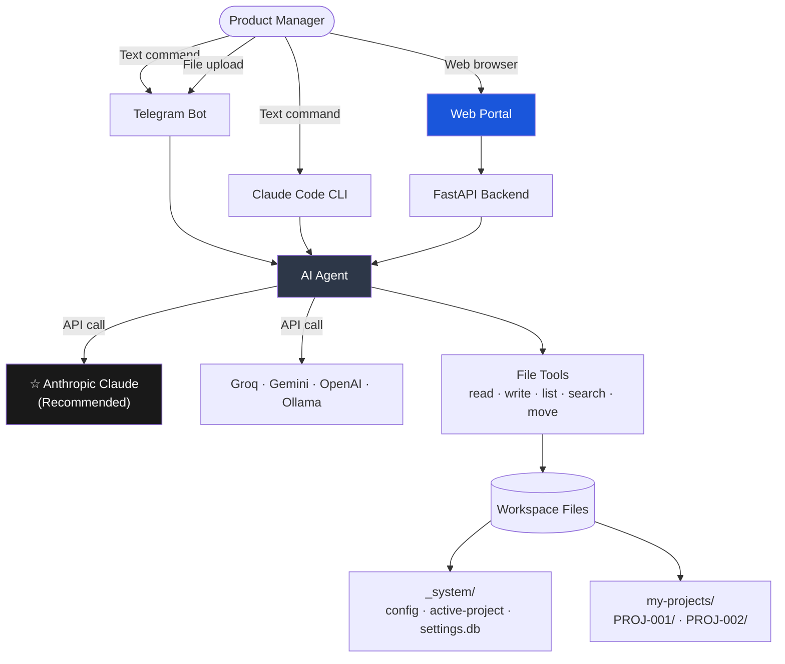
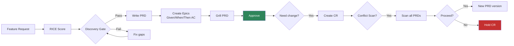

<p align="center">
  <strong>AI PM Skills</strong>
</p>

<p align="center">
  An AI co-pilot for Product Managers — write PRDs, score features, manage Epics,<br/>
  detect conflicts, track stakeholders. Plain language. Your files, your data.
</p>

<p align="center">
  <a href="https://www.anthropic.com/"></a>
  <a href="https://www.python.org/"></a>
  <a href="https://nextjs.org/"></a>
  <a href="https://www.docker.com/"></a>
  <a href="https://telegram.org/"></a>
  
  
</p>

<p align="center">
  🌐
  <a href="_readmes/README.vi.md">🇻🇳 Tiếng Việt</a> ·
  <a href="_readmes/README.zh-CN.md">🇨🇳 中文</a> ·
  <a href="_readmes/README.fr.md">🇫🇷 Français</a> ·
  <a href="_readmes/README.ja.md">🇯🇵 日本語</a> ·
  <a href="_readmes/README.es.md">🇪🇸 Español</a>
</p>

---

## What It Does

You describe what you need. The AI does the PM work.

| You say | What happens |
|---------|-------------|
| `"Create a new project for checkout redesign"` | Full project folder created with discovery, PRD, CR, stakeholder structure |
| `"Create a feature request for dark mode"` | AI interviews you, writes the FR document |
| `"Score FR-001 with RICE"` | AI asks 4 questions, calculates priority score with full formula shown |
| `"Create PRD for FR-001"` | Writes complete PRD — Executive Summary through Team |
| `"Add feedback from Robert — concerned about timeline"` | Saves feedback, scans all documents, suggests what needs updating, asks before changing |
| `"Show all projects"` | Lists all projects with status and health metrics |

---

## Architecture

### System Overview



### PM Workflow



### Project Folder Structure

```
my-pm-workspace/
├── my-projects/
│   ├── PROJ-001-[slug]/             ← isolated, self-contained project
│   │   ├── PROJECT.md               ← definition, milestones, risks
│   │   ├── VERSIONS.md              ← document version audit log (never deleted)
│   │   ├── discovery/
│   │   │   ├── inbox/               ← FR-001.md, FR-002.md ...
│   │   │   ├── scoring/             ← RICE-001.md ...
│   │   │   ├── research/            ← RS-001.md ...
│   │   │   └── gate/                ← approved / rejected / backlog
│   │   ├── prd/PRD-001-[slug]/
│   │   │   ├── PRD-001-v1.0.md      ← approved (immutable)
│   │   │   ├── PRD-001-v1.1.md      ← new draft after CR
│   │   │   └── CHANGELOG.md
│   │   ├── epics/EP-001-[slug]/     ← Given/When/Then AC
│   │   ├── cr/                      ← intake → assessment → approved
│   │   └── stakeholders/            ← profiles + feedback log
│   └── PROJ-002-[slug]/             ← completely separate
├── _system/                         ← runtime config (gitignored)
│   ├── config.md
│   ├── active-project.md            ← which project is active
│   └── settings.db                  ← API keys (SQLite)
└── examples/                        ← sample project with real content
    └── aipm-skills-project/
```

---

## Recommended: Anthropic Claude

**Claude produces the highest quality PRDs, Epics, and stakeholder documents.**

Get your key: **https://console.anthropic.com/settings/keys**

| Model | Cost per 1M tokens | Best for |
|-------|-------------------|---------|
| `claude-sonnet-4-6` | $3 / $15 | Daily PM work — recommended default |
| `claude-opus-4-7` | $5 / $25 | Complex analysis, large PRDs |
| `claude-haiku-4-5` | $1 / $5 | Quick lookups |

---

## Installation

### Step 1 — Clone

```bash
git clone https://github.com/YOUR_USERNAME/aipm_skill_management.git my-pm-workspace
cd my-pm-workspace
cp .env.example .env
```

Edit `.env` — at minimum set your AI key:
```env
ANTHROPIC_API_KEY=sk-ant-your_key_here
```

### Step 2 — Choose what to install

```bash
bash setup.sh
```

```
What would you like to install?

  1) Telegram bot only
  2) Web portal only
  3) Web portal + Telegram bot  ← recommended

Enter option [1/2/3]:
```

On first install, the example project is automatically copied to `my-projects/` so you have real data to explore immediately.

---

## Web Portal

### Chat — split view

```
┌─────────────────────────────────┬────────────────────────────┐
│  Chat with AI                   │  File Viewer               │
│                                 │                            │
│  User: Create feature request   │  FR-001-dark-mode.md      │
│        for dark mode            │  ─────────────────         │
│                                 │  ---                       │
│  AI: Got it. A few questions:   │  fr-id: FR-001             │
│  1. Who is asking for this?     │  title: Dark Mode          │
│  2. What problem does it solve? │  status: draft             │
│                                 │                            │
│  [Tool: write_file] ──────────→ │  [Refresh]                 │
│                                 │                            │
│  [Score FR-001 with RICE]       │                            │
│  [+ Attach file]  [Send]        │                            │
└─────────────────────────────────┴────────────────────────────┘
```

- Left: AI conversation with streaming responses
- Right: File content auto-updates when AI reads or writes a file
- Attach `.docx`, `.pdf`, `.xlsx`, `.csv`, `.md` — stored in `_attachments/`
- Tappable suggestions after every response

### Projects — document management

```
PROJ-001 - AI Alignment           Status: [active ▼]

[Overview] [Discovery] [PRDs] [CR] [Stakeholders] [Documents]

PRDs:
  PRD-001                         [approved ▼]
  Versions:  [⎇ v1.0 ✓ latest]  [⎇ v1.1]
             └── approved         └── draft

[+ Add FR]  [+ Add CR]  [+ Add Stakeholder]

─── After any change ────────────────────────────────────────
[!] Document changed. Run a conflict scan?   [Scan ⚡] [✕]
```

- Version display with active/approved/draft badges
- Click any version → view markdown in right panel
- Status badge: click to change (draft → in-review → approved)
- Add FR / CR / Stakeholder inline forms
- Conflict scan triggered after any change

### Settings — multi-key AI manager

```
Active: Anthropic Claude / claude-sonnet-4-6
        sk-ant-***...1234  [● green]

Saved Keys:
[★ My Anthropic Key]  sk-ant-...  claude-sonnet-4-6   [Active]
[Groq Free Key]       gsk_...     llama-3.3-70b        [Use] [🗑]
[+ Add a new API key]
```

Save multiple keys, switch active with one click. No restart needed.

### Audit Log — document change timeline

```
03 May 2026
  ● created    FR-001-dark-mode.md
  ✎ updated    PRD-001-v1.1.md (status: draft)
  ✓ approved   EP-001-v1.0.md

02 May 2026
  ● created    PROJ-001-aipm-skills
```

---

## Telegram Bot

```bash
# Configure .env
TELEGRAM_BOT_TOKEN=your_token    # from @BotFather
ALLOWED_CHAT_IDS=your_chat_id    # from @userinfobot

# Start
make start

# Manage
make stop / make restart / make logs / make status
```

Open Telegram → `/start` → tap suggestion buttons or type commands.

---

## Bot Commands

```
make start     Start the Telegram bot
make stop      Stop the bot
make restart   Restart
make update    Rebuild image and restart
make logs      Follow live logs
make status    Show health

# Web portal (from apps/ folder)
cd apps
make start     Start web portal
make stop      Stop web portal
make logs      Follow logs
make build     Rebuild after code changes
```

---

## Why It Works

**Stakeholder profiles that remember.** Build a profile from a plain description. Add feedback — the AI saves it, scans all related documents, suggests what needs updating, and shows the proposed changes before touching anything.

**Document coherence.** Every FR, PRD, Epic, CR links together. When a CR is approved, the AI creates a new PRD version and asks if related documents need updating. Nothing falls out of sync silently.

**Change management with audit trail.** Approved documents are immutable. Changes create new versions. Every decision is logged. Nothing is ever lost.

**Conflict detection.** Before any CR or PRD update, the AI asks if you want a conflict scan — checks tag collisions and milestone risks, then presents findings and waits for your confirmation before writing any file.

**Multi-provider AI.** Save multiple API keys, switch with one click. Anthropic Claude recommended. Groq free tier for testing.

---

## Other AI Providers

| Provider | Setup | Cost | Notes |
|---------|-------|------|-------|
| **Anthropic Claude** | `AI_PROVIDER=anthropic` | $1–$25 / 1M tokens | **Recommended** |
| Groq (free) | `AI_PROVIDER=openai` + Groq URL | Free tier | Good for testing |
| Google Gemini | `AI_PROVIDER=google` | Free tier | 15 req/min limit |
| OpenAI GPT | `AI_PROVIDER=openai` | $0.15–$10 / 1M | GPT-4o or mini |
| Ollama (local) | `AI_PROVIDER=openai` + localhost | Free | Needs local GPU |

See `.env.example` for full configuration.

---

## Skills (20 built-in)

| Category | Skills |
|----------|--------|
| Discovery | create-fr, score-feature, gate-review, deep-research |
| PRD | to-prd, manage-epic, conflict-check, grill-prd, update-prd |
| Project | create-project, find-project, project-status |
| Change Requests | intake-cr, assess-cr, approve-cr |
| Stakeholder | add-stakeholder, draft-comms |
| Platform | setup-workspace, new-sprint, version-doc |

---

## Tests

```bash
# Run all tests (84 total)
cd apps/backend && python3 -m pytest ../../tests/ -v

# By category
python3 -m pytest tests/test_installation.py   # 32 tests
python3 -m pytest tests/test_agent_tools.py    # 26 tests
python3 -m pytest tests/test_backend_api.py    # 26 tests
```

---

## Common Questions

**Do I need to be technical?** No. You type plain language. The AI manages all file structure and document creation.

**Where is my data?** Plain markdown files in your project folder. Nothing stored externally.

**Can multiple PMs share a workspace?** Yes — share the folder via Git or a shared drive.

**Can I edit files manually?** Yes. Everything is plain markdown — open in Obsidian, VS Code, Notion, or any editor.

**What if the AI doesn't respond?** Check Settings (`/settings`) — make sure an API key is saved and the active provider shows a green indicator.

---

## References

| Area | Reference |
|------|----------|
| Skill format | [mattpocock/skills](https://github.com/mattpocock/skills) |
| Feature scoring | [RICE Scoring](https://www.intercom.com/blog/rice-simple-prioritization-for-product-managers/) — Intercom |
| Product discovery | [Continuous Discovery Habits](https://www.producttalk.org/) — Teresa Torres |
| PRD standards | [Inspired](https://www.svpg.com/books/inspired-how-to-create-tech-products-customers-love-2nd-edition/) — Marty Cagan |
| User stories | [Writing Good User Stories](https://www.mountaingoatsoftware.com/agile/user-stories) — Mike Cohn |
| Decision records | [Architectural Decision Records](https://adr.github.io/) |

---

CC BY-NC 4.0 License — [Creative Commons Attribution-NonCommercial 4.0](https://creativecommons.org/licenses/by-nc/4.0/)
