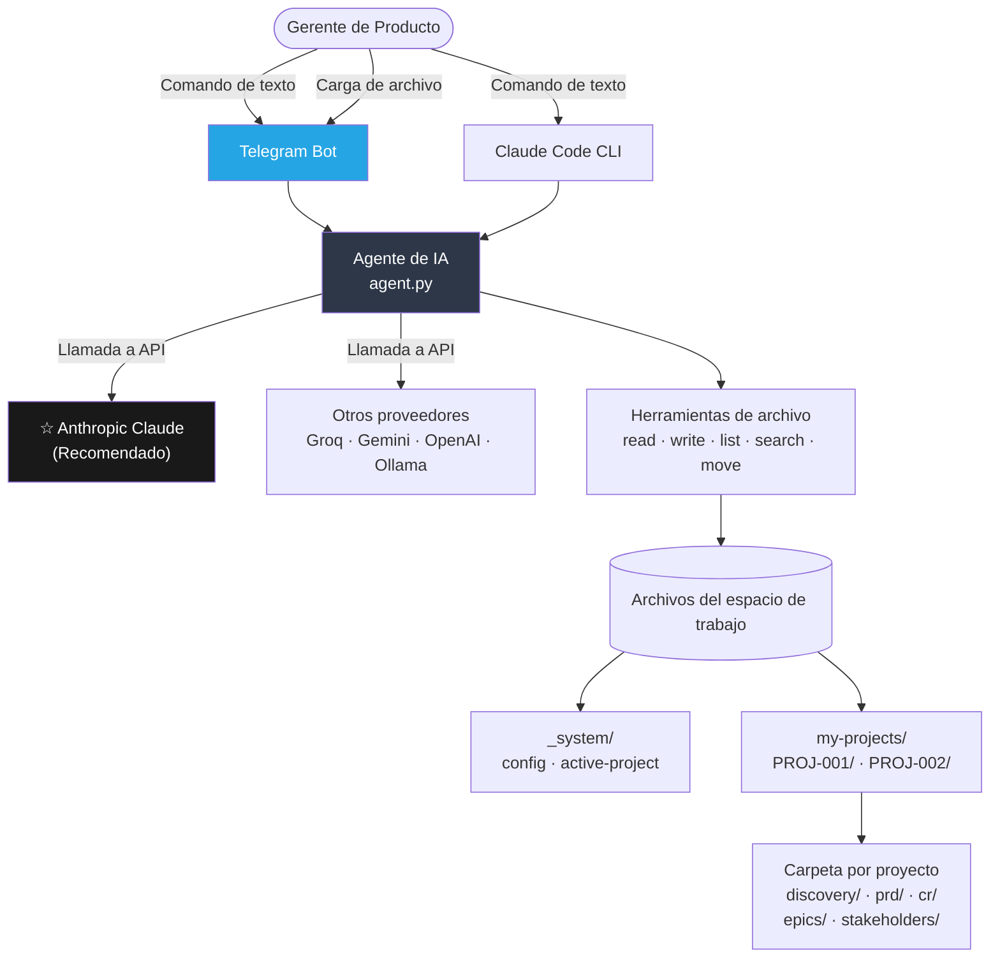

[🇺🇸 English](../README.md)

<p align="center">
  <strong>AI PM Skills</strong>
</p>

<p align="center">
  Copiloto de IA para Gerentes de Producto — puntúa funcionalidades, escribe PRDs, gestiona Épicas,<br/>
  detecta conflictos, hace seguimiento de stakeholders. Lenguaje natural. Archivos propios.
</p>

<p align="center">
  <a href="https://www.anthropic.com/"></a>
  <a href="https://www.python.org/"></a>
  <a href="https://www.docker.com/"></a>
  <a href="https://telegram.org/"></a>
  
</p>

<p align="center">
  🌐 <strong>Idiomas:</strong>
  <a href="README.zh-CN.md">🇨🇳 中文</a> ·
  <a href="README.fr.md">🇫🇷 Français</a> ·
  <a href="README.ja.md">🇯🇵 日本語</a> ·
  <a href="README.es.md">🇪🇸 Español</a>
</p>

---

## Qué hace

Describes lo que necesitas en lenguaje natural. La IA gestiona todo el proceso de PM — documentos, versionado, revisión de conflictos y sugerencias de próximos pasos.

| Tú escribes | Lo que sucede |
|---------|-------------|
| `"Create a new project for checkout redesign"` | Se crea la carpeta completa del proyecto con estructura de discovery, PRD, CR y stakeholders |
| `"Create a feature request for dark mode"` | La IA te entrevista y redacta el documento FR |
| `"Score FR-001 with RICE"` | La IA hace 4 preguntas y calcula la prioridad con la fórmula completa |
| `"Create PRD for FR-001"` | Redacta el PRD completo desde el Resumen Ejecutivo hasta el Equipo |
| `"Approve CR-001"` | Ejecuta el escaneo de conflictos (opcional), crea una nueva versión del PRD y actualiza el registro |
| `"Show all projects"` | Lista todos los proyectos con estado y enlaces para acceder a cada uno |
| Enviar un archivo `.docx` o `.pdf` | La IA lo lee y lo convierte al formato de tu espacio de trabajo |

---

## Arquitectura

### Visión General del Sistema



### Flujo de Trabajo del PM

```mermaid
graph LR
    FR[Solicitud de Funcionalidad] --> RICE[Puntuación RICE]
    RICE --> Gate{Puerta de Discovery}
    Gate -->|Aprobado| PRD[Redactar PRD]
    Gate -->|Rechazado| Fix[Corregir deficiencias]
    Fix --> Gate
    PRD --> Epics[Crear Épicas<br/>Given/When/Then AC]
    Epics --> Grill[Revisar PRD a fondo]
    Grill --> Review[Revisión de Stakeholders]
    Review --> Approve[Aprobado]
    Approve --> Change{¿Se necesita cambio?}
    Change -->|Sí| CR[Crear CR]
    CR --> Scan{¿Escaneo de conflictos?}
    Scan -->|Sí| Check[Escanear todos los PRDs<br/>Mostrar conflictos]
    Check --> Confirm{¿Continuar?}
    Confirm -->|Sí| Apply[Aplicar cambio<br/>Nueva versión de PRD]
    Confirm -->|No| Hold[CR en espera]
    Scan -->|No| Apply

    style Approve fill:#2f855a,color:#fff
    style Hold fill:#c53030,color:#fff
```



### Estructura de Carpetas del Proyecto

```
my-pm-workspace/
├── my-projects/
│   ├── PROJ-001-ai-alignment/       ← carpeta aislada por proyecto
│   │   ├── PROJECT.md               ← definición, hitos, riesgos
│   │   ├── VERSIONS.md              ← registro de auditoría de versiones
│   │   ├── discovery/
│   │   │   ├── inbox/               ← FR-001.md, FR-002.md ...
│   │   │   ├── scoring/             ← RICE-001.md ...
│   │   │   ├── research/            ← RS-001.md ...
│   │   │   └── gate/                ← approved / rejected / backlog
│   │   ├── prd/
│   │   │   └── PRD-001-[slug]/
│   │   │       ├── PRD-001-v1.0.md  ← aprobado, inmutable
│   │   │       ├── PRD-001-v1.1.md  ← nuevo borrador tras CR
│   │   │       └── CHANGELOG.md
│   │   ├── epics/                   ← EP-001-v1.0.md (Given/When/Then AC)
│   │   ├── cr/                      ← intake / assessment / approved
│   │   └── stakeholders/            ← SH-001-[name].md
│   └── PROJ-002-checkout/           ← proyecto completamente independiente
├── _system/
│   ├── config.md                    ← configuración del equipo
│   └── active-project.md            ← ruta del proyecto activo
└── projects-index.md
```

---

## Recomendado: Anthropic Claude

**Claude genera los PRDs, Épicas y documentos de stakeholders de mayor calidad.** Sigue flujos de trabajo de PM de múltiples pasos de manera confiable y produce markdown bien estructurado.

Obtén tu clave de API: **https://console.anthropic.com/settings/keys**

| Modelo | Costo por 1M tokens | Cuándo usarlo |
|-------|-------------------|---------|
| `claude-sonnet-4-6` | $3 entrada / $15 salida | **Trabajo diario de PM — predeterminado recomendado** |
| `claude-opus-4-7` | $5 entrada / $25 salida | Análisis complejos, PRDs extensos |
| `claude-haiku-4-5` | $1 entrada / $5 salida | Consultas rápidas, preguntas simples |

---

## Requisitos

- **Para uso en editor:** [Claude Code](https://claude.ai/download) (CLI de Claude)
- **Para Telegram:** Docker + Docker Compose
- Una clave de API de Anthropic (recomendado) o cualquier proveedor compatible

---

## Instalación

### Opción 1 — Editor (Claude Code)

```bash
git clone https://github.com/YOUR_USERNAME/aipm_skill_management.git my-pm-workspace
cd my-pm-workspace
bash setup.sh
claude
```

Escribe: `Create a new project for [your initiative name]`

### Opción 2 — Bot de Telegram (Docker)

```bash
git clone https://github.com/YOUR_USERNAME/aipm_skill_management.git my-pm-workspace
cd my-pm-workspace
cp .env.example .env
```

Edita `.env`:
```env
# Recomendado: Anthropic Claude
AI_PROVIDER=anthropic
ANTHROPIC_API_KEY=your_key_here
ANTHROPIC_MODEL=claude-sonnet-4-6

# Telegram
TELEGRAM_BOT_TOKEN=your_bot_token
ALLOWED_CHAT_IDS=your_chat_id
```

```bash
make start
```

Abre Telegram → escribe al bot → `/start`

---

## Flujo de Trabajo del PM Paso a Paso

```
Paso 1    "Create a new project for [name]"
          → Se crea la carpeta del proyecto, se muestra el roadmap de 7 pasos

Paso 2    "Create a feature request for [description]"
          → La IA te entrevista: origen, problema, usuarios afectados

Paso 3    "Score FR-001 with RICE"
          → 4 preguntas: Reach, Impact, Confidence, Effort → fórmula RICE

Paso 4    "Gate review FR-001"
          → Verifica puntuación RICE, investigación y sponsor entre stakeholders

Paso 5    "Create PRD for FR-001"
          → PRD completo: Resumen Ejecutivo → Equipo, con tabla de índice de Épicas

Paso 6    "Create epic for PRD-001: [name]"
          → Given/When/Then AC completos (3+ escenarios por historia de usuario)

Paso 7    "Grill PRD-001"
          → Prueba de estrés: evidencia, casos límite, métricas, líneas base

Paso 8    "Submit PRD-001-v1.0 for review" / "Approve PRD-001-v1.0"

Paso 9    "Create CR for PRD-001"
          → La IA pregunta: "¿Ejecutar escaneo de conflictos primero? Yes / No"
          → Si sí: escanea todos los PRDs, muestra conflictos y solicita confirmación
```

---

## Versionado de Documentos

Todos los documentos siguen un modelo de instantánea inmutable:

```
PRD-001-v1.0.md   ← aprobado (bloqueado permanentemente)
PRD-001-v1.1.md   ← aprobado (bloqueado permanentemente)
PRD-001-v2.0.md   ← borrador actual
```

`VERSIONS.md` en cada proyecto es el registro de auditoría. Las filas nunca se eliminan.

Ciclo de vida del estado: `draft → in-review → approved` (o `rejected → new draft`)

---

## Detección de Conflictos

Al crear un CR, actualizar un PRD o aprobar un cambio:

```
Bot: ¿Deseas que ejecute un escaneo de conflictos antes de continuar?
     - "Yes" → escanea todos los PRDs, muestra los hallazgos y solicita confirmación
     - "No"  → continúa directamente

--- Si Yes ---

ESCANEO DE CONFLICTOS: PROJ-001 - AI Alignment
Cambio: CR-003 — actualización del contrato de API

[ADVERTENCIA] Conflicto de etiqueta: #api-gateway
  PRD-001 y PRD-002 ambos afectan este módulo.
  El equipo de PRD-002 podría necesitar actualizar su implementación.

[ADVERTENCIA] Hito M2 en riesgo (objetivo: 30/06/2026)
  El rediseño de PRD-002 podría retrasar M2 en 1-2 sprints.

[OK] Ningún otro PRD afectado.
Riesgo general: MEDIO

¿Deseas continuar?
- "Yes, proceed" / "No, hold" / "Show PRD-002"
```

El bot no escribe ningún archivo hasta que el PM confirme.

---

## Adjuntos de Archivos

Envía archivos directamente al bot de Telegram:

| Formato | Lo que hace la IA |
|--------|-----------------|
| `.docx` / `.doc` | Lee el texto y los encabezados → convierte a markdown |
| `.pdf` | Extrae el texto página por página |
| `.xlsx` / `.xls` | Convierte tablas a markdown |
| `.csv` | Convierte a tabla markdown |
| `.md` / `.txt` | Lee directamente |

Agrega un pie de foto con instrucciones, o envíalo sin uno y la IA preguntará.

---

## Comandos del Bot

| Comando Make | Qué hace |
|-------------|-------------|
| `make start` | Inicia el bot de Telegram |
| `make stop` | Detiene el bot |
| `make restart` | Reinicia tras cambios en `.env` |
| `make update` | Reconstruye y reinicia tras cambios en el código |
| `make logs` | Sigue los registros en tiempo real |
| `make status` | Muestra el estado del contenedor |

Comandos de Telegram: `/start` `/help` `/reset`

---

## Habilidades (20 integradas)

| Categoría | Habilidades |
|----------|--------|
| Discovery | create-fr, score-feature, gate-review, deep-research |
| PRD | to-prd, manage-epic, conflict-check, grill-prd, update-prd |
| Proyecto | create-project, find-project, project-status |
| Solicitudes de Cambio | intake-cr, assess-cr, approve-cr |
| Stakeholders | add-stakeholder, draft-comms |
| Plataforma | setup-workspace, new-sprint, version-doc |

---

## Otros Proveedores de IA

| Proveedor | Configuración | Costo | Notas |
|---------|-------|------|-------|
| **Anthropic Claude** | `AI_PROVIDER=anthropic` | $1–$25 / 1M tokens | **Recomendado** |
| Groq (gratuito) | `AI_PROVIDER=openai` + URL base de Groq | Nivel gratuito | Rápido, ideal para pruebas |
| Google Gemini | `AI_PROVIDER=google` | Nivel gratuito disponible | Límite de 15 solicitudes/minuto |
| OpenAI GPT | `AI_PROVIDER=openai` | $0.15–$10 / 1M tokens | GPT-4o o mini |
| Ollama (local) | `AI_PROVIDER=openai` + URL localhost | Gratuito | Requiere GPU local |

Consulta `.env.example` para la configuración completa de cada proveedor.

---

## Preguntas Frecuentes

**¿Necesito conocimientos técnicos?**
No. Escribes en lenguaje natural. La IA gestiona toda la creación y organización de archivos.

**¿Dónde se guardan mis datos?**
Todo se almacena como archivos markdown planos en la carpeta de tu proyecto, en tu propia máquina.

**¿Pueden varios PMs compartir un espacio de trabajo?**
Sí. Comparte la carpeta mediante Git o una unidad compartida. Cada PM ejecuta su propio cliente.

**¿Puedo editar los archivos manualmente?**
Sí. Todos los archivos son markdown plano — ábrelos en Obsidian, VS Code, Notion o cualquier editor.

**¿Qué pasa si un comando no funciona?**
El bot sugiere el comando más cercano basándose en lo que escribiste y tu trabajo reciente.

---

## Referencias

| Área | Referencia |
|------|----------|
| Formato de habilidades | [mattpocock/skills](https://github.com/mattpocock/skills) |
| Puntuación de funcionalidades | [RICE Scoring](https://www.intercom.com/blog/rice-simple-prioritization-for-product-managers/) — Intercom |
| Discovery de producto | [Continuous Discovery Habits](https://www.producttalk.org/) — Teresa Torres |
| Estándares de PRD | [Inspired](https://www.svpg.com/books/inspired-how-to-create-tech-products-customers-love-2nd-edition/) — Marty Cagan |
| Historias de usuario | [Writing Good User Stories](https://www.mountaingoatsoftware.com/agile/user-stories) — Mike Cohn |
| Registros de decisiones | [Architectural Decision Records](https://adr.github.io/) |

---

Licencia MIT
