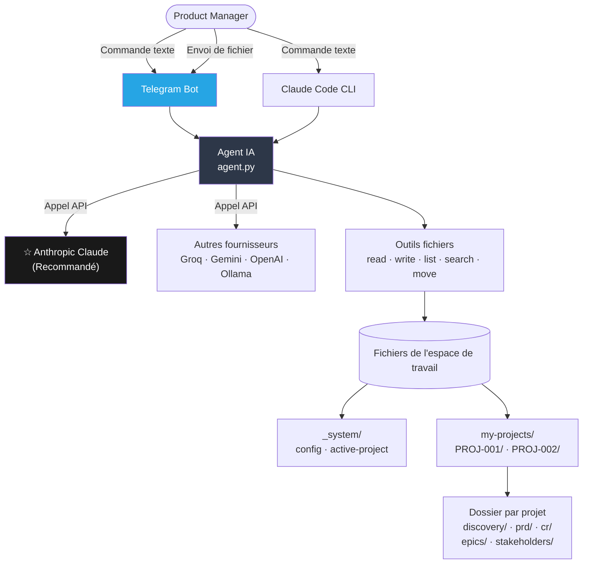

[🇺🇸 English](../README.md)

<p align="center">
  <strong>AI PM Skills</strong>
</p>

<p align="center">
  Co-pilote IA pour les Product Managers — évaluez les fonctionnalités, rédigez des PRD, gérez les Epics,<br/>
  détectez les conflits, suivez les parties prenantes. Langage naturel. Fichiers sous votre contrôle.
</p>

<p align="center">
  <a href="https://www.anthropic.com/"></a>
  <a href="https://www.python.org/"></a>
  <a href="https://www.docker.com/"></a>
  <a href="https://telegram.org/"></a>
  
</p>

<p align="center">
  🌐 <strong>Langues :</strong>
  <a href="../README.md">🇺🇸 English</a> ·
  <a href="README.zh-CN.md">🇨🇳 中文</a> ·
  <a href="README.ja.md">🇯🇵 日本語</a> ·
  <a href="README.es.md">🇪🇸 Español</a>
</p>

---

## Ce que ça fait

Vous décrivez vos besoins en langage naturel. L'IA gère le processus produit — documents, gestion des versions, vérification des conflits et suggestions d'étapes suivantes.

| Vous dites | Ce qui se passe |
|-----------|----------------|
| `"Create a new project for checkout redesign"` | Dossier projet complet créé avec structure discovery, PRD, CR et parties prenantes |
| `"Create a feature request for dark mode"` | L'IA vous interview et rédige le document de demande fonctionnelle |
| `"Score FR-001 with RICE"` | L'IA pose 4 questions, calcule la priorité avec la formule complète |
| `"Create PRD for FR-001"` | Rédige un PRD complet du Résumé Exécutif jusqu'à l'équipe |
| `"Approve CR-001"` | Effectue un scan de conflits (optionnel), crée une nouvelle version du PRD, met à jour le journal |
| `"Show all projects"` | Liste tous les projets avec leur statut et des liens d'accès rapide |
| Envoyer un fichier `.docx` ou `.pdf` | L'IA le lit et le convertit dans votre espace de travail |

---

## Architecture

### Vue d'ensemble du système



### Flux de travail produit

```mermaid
graph LR
    FR[Demande fonctionnelle] --> RICE[Score RICE]
    RICE --> Gate{Porte de Discovery}
    Gate -->|Passage| PRD[Rédiger le PRD]
    Gate -->|Échec| Fix[Combler les lacunes]
    Fix --> Gate
    PRD --> Epics[Créer les Epics<br/>Critères Given/When/Then]
    Epics --> Grill[Tester le PRD]
    Grill --> Review[Revue parties prenantes]
    Review --> Approve[Approuvé]
    Approve --> Change{Modification nécessaire ?}
    Change -->|Oui| CR[Créer une demande de modification]
    CR --> Scan{Scan de conflits ?}
    Scan -->|Oui| Check[Scanner tous les PRD<br/>Afficher les conflits]
    Check --> Confirm{Continuer ?}
    Confirm -->|Oui| Apply[Appliquer la modification<br/>Nouvelle version du PRD]
    Confirm -->|Non| Hold[Suspendre la demande]
    Scan -->|Non| Apply

    style Approve fill:#2f855a,color:#fff
    style Hold fill:#c53030,color:#fff
```



### Structure des dossiers de projet

```
my-pm-workspace/
├── my-projects/
│   ├── PROJ-001-ai-alignment/       ← dossier projet isolé
│   │   ├── PROJECT.md               ← définition, jalons, risques
│   │   ├── VERSIONS.md              ← journal d'audit des versions de documents
│   │   ├── discovery/
│   │   │   ├── inbox/               ← FR-001.md, FR-002.md ...
│   │   │   ├── scoring/             ← RICE-001.md ...
│   │   │   ├── research/            ← RS-001.md ...
│   │   │   └── gate/                ← approved / rejected / backlog
│   │   ├── prd/
│   │   │   └── PRD-001-[slug]/
│   │   │       ├── PRD-001-v1.0.md  ← approuvé, immuable
│   │   │       ├── PRD-001-v1.1.md  ← nouveau brouillon après CR
│   │   │       └── CHANGELOG.md
│   │   ├── epics/                   ← EP-001-v1.0.md (critères Given/When/Then)
│   │   ├── cr/                      ← intake / assessment / approved
│   │   └── stakeholders/            ← SH-001-[name].md
│   └── PROJ-002-checkout/           ← complètement séparé
├── _system/
│   ├── config.md                    ← paramètres d'équipe
│   └── active-project.md            ← chemin du projet en cours
└── projects-index.md
```

---

## Recommandé : Anthropic Claude

**Claude produit des PRD, des Epics et des documents de parties prenantes de la plus haute qualité.** Il suit de manière fiable les flux de travail produit en plusieurs étapes et génère un Markdown bien structuré.

Obtenez votre clé API : **https://console.anthropic.com/settings/keys**

| Modèle | Coût par million de tokens | Utilisation recommandée |
|--------|---------------------------|------------------------|
| `claude-sonnet-4-6` | $3 en entrée / $15 en sortie | **Travail PM quotidien — défaut recommandé** |
| `claude-opus-4-7` | $5 en entrée / $25 en sortie | Analyses complexes, PRD volumineux |
| `claude-haiku-4-5` | $1 en entrée / $5 en sortie | Recherches rapides, questions simples |

---

## Prérequis

- **Pour l'utilisation en éditeur :** [Claude Code](https://claude.ai/download) (CLI de Claude)
- **Pour Telegram :** Docker + Docker Compose
- Une clé API Anthropic (recommandée) ou tout fournisseur pris en charge

---

## Installation

### Option 1 — Éditeur (Claude Code)

```bash
git clone https://github.com/YOUR_USERNAME/aipm_skill_management.git my-pm-workspace
cd my-pm-workspace
bash setup.sh
claude
```

Tapez : `Create a new project for [your initiative name]`

### Option 2 — Bot Telegram (Docker)

```bash
git clone https://github.com/YOUR_USERNAME/aipm_skill_management.git my-pm-workspace
cd my-pm-workspace
cp .env.example .env
```

Modifiez `.env` :
```env
# Recommandé : Anthropic Claude
AI_PROVIDER=anthropic
ANTHROPIC_API_KEY=your_key_here
ANTHROPIC_MODEL=claude-sonnet-4-6

# Telegram
TELEGRAM_BOT_TOKEN=your_bot_token
ALLOWED_CHAT_IDS=your_chat_id
```

```bash
make start
```

Ouvrez Telegram → écrivez à votre bot → `/start`

---

## Flux de travail PM étape par étape

```
Étape 1    "Create a new project for [name]"
           → Dossier projet créé, feuille de route en 7 étapes affichée

Étape 2    "Create a feature request for [description]"
           → L'IA vous interview : source, problème, utilisateurs concernés

Étape 3    "Score FR-001 with RICE"
           → 4 questions : Portée, Impact, Confiance, Effort → formule RICE

Étape 4    "Gate review FR-001"
           → Vérifie le score RICE, la recherche, le sponsor parties prenantes

Étape 5    "Create PRD for FR-001"
           → PRD complet : Résumé Exécutif → Équipe, avec tableau d'index des Epics

Étape 6    "Create epic for PRD-001: [name]"
           → Critères d'acceptation Given/When/Then complets (3+ scénarios par user story)

Étape 7    "Grill PRD-001"
           → Test de robustesse : preuves, cas limites, métriques, référentiels

Étape 8    "Submit PRD-001-v1.0 for review" / "Approve PRD-001-v1.0"

Étape 9    "Create CR for PRD-001"
           → L'IA demande : "Lancer un scan de conflits d'abord ? Oui / Non"
           → Si oui : scanne tous les PRD, affiche les conflits, demande confirmation
```

---

## Gestion des versions de documents

Chaque document suit un modèle de capture immuable :

```
PRD-001-v1.0.md   ← approuvé (verrouillé définitivement)
PRD-001-v1.1.md   ← approuvé (verrouillé définitivement)
PRD-001-v2.0.md   ← brouillon en cours
```

Le fichier `VERSIONS.md` dans chaque projet constitue le journal d'audit. Les lignes ne sont jamais supprimées.

Cycle de vie des statuts : `brouillon → en revue → approuvé` (ou `rejeté → nouveau brouillon`)

---

## Détection des conflits

Lors de la création d'une demande de modification, de la mise à jour d'un PRD ou de l'approbation d'un changement :

```
Bot : Souhaitez-vous lancer un scan de conflits avant de continuer ?
      - "Oui" → scanner tous les PRD, afficher les résultats, demander confirmation
      - "Non"  → continuer directement

--- Si Oui ---

SCAN DE CONFLITS : PROJ-001 - AI Alignment
Modification : CR-003 — Mise à jour du contrat API

[AVERTISSEMENT] Conflit de tag : #api-gateway
  PRD-001 et PRD-002 touchent tous deux ce module.
  L'équipe PRD-002 devra peut-être mettre à jour son implémentation.

[AVERTISSEMENT] Jalon M2 à risque (cible : 30/06/2026)
  La refonte de PRD-002 pourrait retarder M2 de 1 à 2 sprints.

[OK] Aucun autre PRD affecté.
Risque global : MOYEN

Voulez-vous continuer ?
- "Yes, proceed" / "No, hold" / "Show PRD-002"
```

Le bot n'écrit aucun fichier tant que le PM n'a pas confirmé.

---

## Pièces jointes

Envoyez des fichiers directement au bot Telegram :

| Format | Ce que fait l'IA |
|--------|-----------------|
| `.docx` / `.doc` | Lit le texte et les titres → convertit en Markdown |
| `.pdf` | Extrait le texte page par page |
| `.xlsx` / `.xls` | Convertit les tableaux en Markdown |
| `.csv` | Convertit en tableau Markdown |
| `.md` / `.txt` | Lecture directe |

Ajoutez une légende pour donner des instructions, ou envoyez sans légende et l'IA demandera.

---

## Commandes du bot

| Commande Make | Fonctionnement |
|--------------|---------------|
| `make start` | Démarrer le bot Telegram |
| `make stop` | Arrêter le bot |
| `make restart` | Redémarrer après modification de `.env` |
| `make update` | Reconstruire et redémarrer après modification du code |
| `make logs` | Suivre les journaux en direct |
| `make status` | Afficher l'état du conteneur |

Commandes Telegram : `/start` `/help` `/reset`

---

## Compétences (20 intégrées)

| Catégorie | Compétences |
|-----------|------------|
| Discovery | create-fr, score-feature, gate-review, deep-research |
| PRD | to-prd, manage-epic, conflict-check, grill-prd, update-prd |
| Projet | create-project, find-project, project-status |
| Demandes de modification | intake-cr, assess-cr, approve-cr |
| Parties prenantes | add-stakeholder, draft-comms |
| Plateforme | setup-workspace, new-sprint, version-doc |

---

## Autres fournisseurs IA

| Fournisseur | Configuration | Coût | Remarques |
|------------|--------------|------|-----------|
| **Anthropic Claude** | `AI_PROVIDER=anthropic` | $1–$25 / 1M tokens | **Recommandé** |
| Groq (gratuit) | `AI_PROVIDER=openai` + URL de base Groq | Tier gratuit | Rapide, idéal pour les tests |
| Google Gemini | `AI_PROVIDER=google` | Tier gratuit disponible | Limite de 15 req/min |
| OpenAI GPT | `AI_PROVIDER=openai` | $0,15–$10 / 1M tokens | GPT-4o ou mini |
| Ollama (local) | `AI_PROVIDER=openai` + URL localhost | Gratuit | Nécessite un GPU local |

Consultez `.env.example` pour la configuration complète de chaque fournisseur.

---

## Questions fréquentes

**Faut-il des compétences techniques ?**
Non. Vous tapez en langage naturel. L'IA gère toute la création et l'organisation des fichiers.

**Où sont stockées mes données ?**
Tout est stocké sous forme de fichiers Markdown simples dans votre dossier de projet, sur votre machine.

**Plusieurs PM peuvent-ils partager un espace de travail ?**
Oui. Partagez le dossier via Git ou un lecteur partagé. Chaque PM utilise son propre client.

**Puis-je modifier les fichiers manuellement ?**
Oui. Tous les fichiers sont en Markdown simple — ouvrez-les dans Obsidian, VS Code, Notion ou tout autre éditeur.

**Que faire si une commande ne fonctionne pas ?**
Le bot suggère la commande la plus proche en fonction de ce que vous avez tapé et de votre travail récent.

---

## Références

| Domaine | Référence |
|---------|----------|
| Format des compétences | [mattpocock/skills](https://github.com/mattpocock/skills) |
| Évaluation des fonctionnalités | [RICE Scoring](https://www.intercom.com/blog/rice-simple-prioritization-for-product-managers/) — Intercom |
| Discovery produit | [Continuous Discovery Habits](https://www.producttalk.org/) — Teresa Torres |
| Standards PRD | [Inspired](https://www.svpg.com/books/inspired-how-to-create-tech-products-customers-love-2nd-edition/) — Marty Cagan |
| User stories | [Writing Good User Stories](https://www.mountaingoatsoftware.com/agile/user-stories) — Mike Cohn |
| Enregistrements de décisions | [Architectural Decision Records](https://adr.github.io/) |

---

CC BY-NC 4.0 License — Creative Commons Attribution-NonCommercial 4.0
