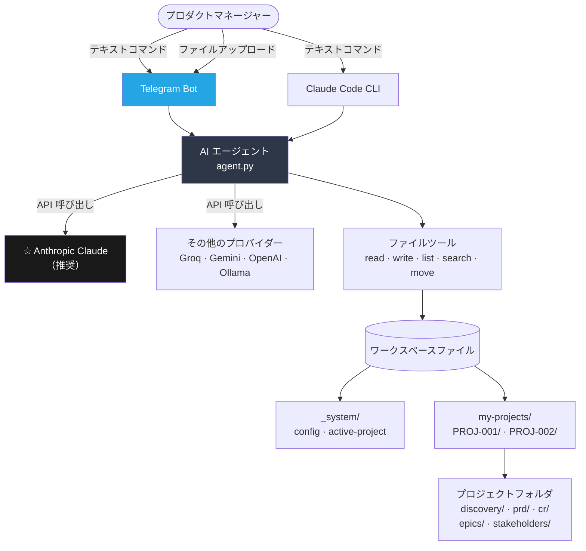
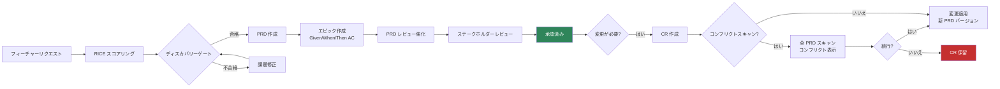

[🇺🇸 English](../README.md)

<p align="center">
  <strong>AI PM スキル</strong>
</p>

<p align="center">
  プロダクトマネージャーのための AI コパイロット — フィーチャーのスコアリング、PRD 作成、エピック管理、<br/>
  コンフリクト検出、ステークホルダー管理。平易な言葉で。自分のファイルで。
</p>

<p align="center">
  <a href="https://www.anthropic.com/"></a>
  <a href="https://www.python.org/"></a>
  <a href="https://www.docker.com/"></a>
  <a href="https://telegram.org/"></a>
  
</p>

<p align="center">
  🌐 <strong>言語:</strong>
  <a href="README.zh-CN.md">🇨🇳 中文</a> ·
  <a href="README.fr.md">🇫🇷 Français</a> ·
  <a href="README.ja.md">🇯🇵 日本語</a> ·
  <a href="README.es.md">🇪🇸 Español</a>
</p>

---

## 機能概要

平易な言葉で必要なことを伝えるだけ。AI が PM プロセス全体を担当します — ドキュメント作成、バージョン管理、コンフリクトチェック、次のステップの提案まで。

| あなたの入力 | 実行されること |
|---------|-------------|
| `"Create a new project for checkout redesign"` | ディスカバリー、PRD、CR、ステークホルダー構成を含む完全なプロジェクトフォルダが作成される |
| `"Create a feature request for dark mode"` | AI がインタビューを行い、FR ドキュメントを作成する |
| `"Score FR-001 with RICE"` | AI が 4 つの質問をし、完全な計算式で優先度を算出する |
| `"Create PRD for FR-001"` | エグゼクティブサマリーからチーム構成まで、完全な PRD を作成する |
| `"Approve CR-001"` | コンフリクトスキャン（任意）を実行し、新しい PRD バージョンを作成してログを更新する |
| `"Show all projects"` | 全プロジェクトをステータス付きで一覧表示し、各プロジェクトへのリンクを表示する |
| `.docx` または `.pdf` ファイルの送信 | AI がファイルを読み込み、ワークスペース形式に変換する |

---

## アーキテクチャ

### システム概要



### PM ワークフロー



### プロジェクトフォルダ構成

```
my-pm-workspace/
├── my-projects/
│   ├── PROJ-001-ai-alignment/       ← 独立したプロジェクトフォルダ
│   │   ├── PROJECT.md               ← 定義、マイルストーン、リスク
│   │   ├── VERSIONS.md              ← ドキュメントバージョン監査ログ
│   │   ├── discovery/
│   │   │   ├── inbox/               ← FR-001.md, FR-002.md ...
│   │   │   ├── scoring/             ← RICE-001.md ...
│   │   │   ├── research/            ← RS-001.md ...
│   │   │   └── gate/                ← approved / rejected / backlog
│   │   ├── prd/
│   │   │   └── PRD-001-[slug]/
│   │   │       ├── PRD-001-v1.0.md  ← 承認済み、変更不可
│   │   │       ├── PRD-001-v1.1.md  ← CR 後の新しいドラフト
│   │   │       └── CHANGELOG.md
│   │   ├── epics/                   ← EP-001-v1.0.md (Given/When/Then AC)
│   │   ├── cr/                      ← intake / assessment / approved
│   │   └── stakeholders/            ← SH-001-[name].md
│   └── PROJ-002-checkout/           ← 完全に独立したプロジェクト
├── _system/
│   ├── config.md                    ← チーム設定
│   └── active-project.md            ← 現在の作業プロジェクトパス
└── projects-index.md
```

---

## 推奨: Anthropic Claude

**Claude は最高品質の PRD、エピック、ステークホルダードキュメントを生成します。** 複数ステップの PM ワークフローを確実に実行し、構造化されたマークダウンを生成します。

API キーの取得: **https://console.anthropic.com/settings/keys**

| モデル | 100万トークンあたりのコスト | 使用タイミング |
|-------|-------------------|---------|
| `claude-sonnet-4-6` | 入力 $3 / 出力 $15 | **日常的な PM 業務 — 推奨デフォルト** |
| `claude-opus-4-7` | 入力 $5 / 出力 $25 | 複雑な分析、大規模 PRD |
| `claude-haiku-4-5` | 入力 $1 / 出力 $5 | 簡単な検索、シンプルな質問 |

---

## 必要環境

- **エディタでの使用:** [Claude Code](https://claude.ai/download)（Claude の CLI）
- **Telegram の場合:** Docker + Docker Compose
- Anthropic API キー（推奨）または対応プロバイダーのいずれか

---

## インストール

### オプション 1 — エディタ（Claude Code）

```bash
git clone https://github.com/YOUR_USERNAME/aipm_skill_management.git my-pm-workspace
cd my-pm-workspace
bash setup.sh
claude
```

入力例: `Create a new project for [your initiative name]`

### オプション 2 — Telegram ボット（Docker）

```bash
git clone https://github.com/YOUR_USERNAME/aipm_skill_management.git my-pm-workspace
cd my-pm-workspace
cp .env.example .env
```

`.env` を編集:
```env
# 推奨: Anthropic Claude
AI_PROVIDER=anthropic
ANTHROPIC_API_KEY=your_key_here
ANTHROPIC_MODEL=claude-sonnet-4-6

# Telegram
TELEGRAM_BOT_TOKEN=your_bot_token
ALLOWED_CHAT_IDS=your_chat_id
```

```bash
make start
```

Telegram を開く → ボットにメッセージ → `/start`

---

## PM ワークフロー ステップバイステップ

```
ステップ 1    "Create a new project for [name]"
              → プロジェクトフォルダが作成され、7 ステップのロードマップが表示される

ステップ 2    "Create a feature request for [description]"
              → AI がインタビュー: ソース、課題、影響を受けるユーザー

ステップ 3    "Score FR-001 with RICE"
              → 4 つの質問: Reach、Impact、Confidence、Effort → RICE 計算式

ステップ 4    "Gate review FR-001"
              → RICE スコア、リサーチ、ステークホルダースポンサーを確認

ステップ 5    "Create PRD for FR-001"
              → 完全な PRD: エグゼクティブサマリー → チーム（エピックインデックステーブル付き）

ステップ 6    "Create epic for PRD-001: [name]"
              → 完全な Given/When/Then AC（ユーザーストーリーごとに 3 シナリオ以上）

ステップ 7    "Grill PRD-001"
              → ストレステスト: エビデンス、エッジケース、メトリクス、ベースライン

ステップ 8    "Submit PRD-001-v1.0 for review" / "Approve PRD-001-v1.0"

ステップ 9    "Create CR for PRD-001"
              → AI が確認: "先にコンフリクトスキャンを実行しますか? Yes / No"
              → Yes の場合: 全 PRD をスキャンし、コンフリクトを表示して確認を求める
```

---

## ドキュメントのバージョン管理

すべてのドキュメントはイミュータブルスナップショットモデルに従います:

```
PRD-001-v1.0.md   ← 承認済み（永久にロック）
PRD-001-v1.1.md   ← 承認済み（永久にロック）
PRD-001-v2.0.md   ← 現在のドラフト
```

各プロジェクトの `VERSIONS.md` が監査ログです。行は絶対に削除されません。

ステータスのライフサイクル: `draft → in-review → approved`（または `rejected → new draft`）

---

## コンフリクト検出

CR の作成時、PRD の更新時、または変更の承認時:

```
Bot: 続行する前にコンフリクトスキャンを実行しますか?
     - "Yes" → 全 PRD をスキャン、結果を表示し確認を求める
     - "No"  → 直接続行する

--- Yes の場合 ---

コンフリクトスキャン: PROJ-001 - AI Alignment
変更: CR-003 — API コントラクトの更新

[警告] タグのコンフリクト: #api-gateway
  PRD-001 と PRD-002 の両方がこのモジュールに関係しています。
  PRD-002 チームは実装を更新する必要がある可能性があります。

[警告] マイルストーン M2 にリスクあり（目標: 30/06/2026）
  PRD-002 の修正作業により M2 が 1〜2 スプリント遅延する可能性があります。

[OK] 他に影響を受ける PRD はありません。
総合リスク: 中程度

続行しますか?
- "Yes, proceed" / "No, hold" / "Show PRD-002"
```

PM が確認するまで、ボットはファイルを書き込みません。

---

## ファイル添付

Telegram ボットに直接ファイルを送信:

| フォーマット | AI の処理内容 |
|--------|-----------------|
| `.docx` / `.doc` | テキストと見出しを読み込み → マークダウンに変換 |
| `.pdf` | ページごとにテキストを抽出 |
| `.xlsx` / `.xls` | テーブルをマークダウンに変換 |
| `.csv` | マークダウンテーブルに変換 |
| `.md` / `.txt` | そのまま読み込み |

指示をキャプションとして添付するか、何も付けずに送信すると AI が確認します。

---

## ボットコマンド

| Make コマンド | 処理内容 |
|-------------|-------------|
| `make start` | Telegram ボットを起動 |
| `make stop` | ボットを停止 |
| `make restart` | `.env` 変更後に再起動 |
| `make update` | コード変更後にリビルドして再起動 |
| `make logs` | ライブログをフォロー |
| `make status` | コンテナの状態を表示 |

Telegram コマンド: `/start` `/help` `/reset`

---

## スキル（20 種類の組み込み機能）

| カテゴリ | スキル |
|----------|--------|
| ディスカバリー | create-fr, score-feature, gate-review, deep-research |
| PRD | to-prd, manage-epic, conflict-check, grill-prd, update-prd |
| プロジェクト | create-project, find-project, project-status |
| 変更リクエスト | intake-cr, assess-cr, approve-cr |
| ステークホルダー | add-stakeholder, draft-comms |
| プラットフォーム | setup-workspace, new-sprint, version-doc |

---

## その他の AI プロバイダー

| プロバイダー | 設定 | コスト | 備考 |
|---------|-------|------|-------|
| **Anthropic Claude** | `AI_PROVIDER=anthropic` | $1〜$25 / 100万トークン | **推奨** |
| Groq（無料） | `AI_PROVIDER=openai` + Groq ベース URL | 無料枠あり | 高速、テストに最適 |
| Google Gemini | `AI_PROVIDER=google` | 無料枠あり | 毎分 15 リクエスト制限 |
| OpenAI GPT | `AI_PROVIDER=openai` | $0.15〜$10 / 100万トークン | GPT-4o または mini |
| Ollama（ローカル） | `AI_PROVIDER=openai` + localhost URL | 無料 | ローカル GPU が必要 |

各プロバイダーの完全な設定については `.env.example` を参照してください。

---

## よくある質問

**技術的な知識は必要ですか?**
必要ありません。平易な言葉で入力するだけです。AI がすべてのファイル作成と整理を管理します。

**データはどこに保存されますか?**
すべてのデータは、ご自身のマシン上のプロジェクトフォルダ内にプレーンなマークダウンファイルとして保存されます。

**複数の PM がワークスペースを共有できますか?**
はい。Git または共有ドライブでフォルダを共有できます。各 PM は自分のクライアントを使用します。

**ファイルを手動で編集できますか?**
はい。すべてのファイルはプレーンなマークダウン形式です — Obsidian、VS Code、Notion、またはお好みのエディタで開くことができます。

**コマンドが動作しない場合はどうすれば良いですか?**
ボットが入力内容と最近の作業に基づいて、最も近いコマンドを提案します。

---

## 参考資料

| 分野 | 参考資料 |
|------|----------|
| スキルフォーマット | [mattpocock/skills](https://github.com/mattpocock/skills) |
| フィーチャースコアリング | [RICE Scoring](https://www.intercom.com/blog/rice-simple-prioritization-for-product-managers/) — Intercom |
| プロダクトディスカバリー | [Continuous Discovery Habits](https://www.producttalk.org/) — Teresa Torres |
| PRD 標準 | [Inspired](https://www.svpg.com/books/inspired-how-to-create-tech-products-customers-love-2nd-edition/) — Marty Cagan |
| ユーザーストーリー | [Writing Good User Stories](https://www.mountaingoatsoftware.com/agile/user-stories) — Mike Cohn |
| 意思決定記録 | [Architectural Decision Records](https://adr.github.io/) |

---

CC BY-NC 4.0 License — Creative Commons Attribution-NonCommercial 4.0
