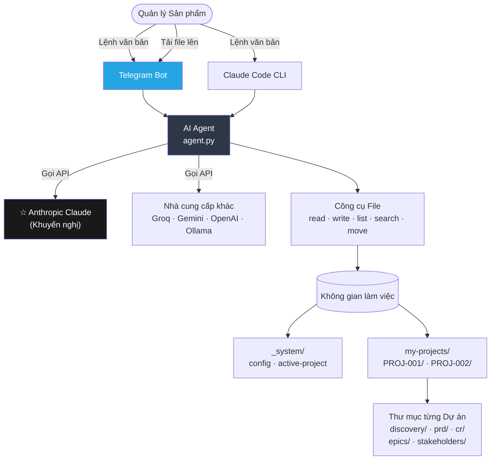

[🇺🇸 English](../README.md)

<p align="center">
  <strong>AI PM Skills</strong>
</p>

<p align="center">
  AI co-pilot cho Quản lý Sản phẩm — chấm điểm tính năng, viết Tài liệu yêu cầu sản phẩm, quản lý Epic,<br/>
  phát hiện xung đột, theo dõi các bên liên quan. Ngôn ngữ tự nhiên. File thuộc sở hữu của bạn.
</p>

<p align="center">
  <a href="https://www.anthropic.com/"></a>
  <a href="https://www.python.org/"></a>
  <a href="https://www.docker.com/"></a>
  <a href="https://telegram.org/"></a>
  
</p>

<p align="center">
  🌐 <strong>Ngôn ngữ:</strong>
  <a href="README.zh-CN.md">🇨🇳 中文</a> ·
  <a href="README.fr.md">🇫🇷 Français</a> ·
  <a href="README.ja.md">🇯🇵 日本語</a> ·
  <a href="README.es.md">🇪🇸 Español</a>
</p>

---

## Tính Năng Chính

Bạn mô tả nhu cầu bằng ngôn ngữ tự nhiên. AI xử lý toàn bộ quy trình PM — tài liệu, quản lý phiên bản, kiểm tra xung đột và gợi ý bước tiếp theo.

| Bạn nói | Điều xảy ra |
|---------|-------------|
| `"Create a new project for checkout redesign"` | Tạo thư mục dự án đầy đủ với cấu trúc khám phá, PRD, CR, bên liên quan |
| `"Create a feature request for dark mode"` | AI phỏng vấn bạn, viết tài liệu Yêu cầu tính năng |
| `"Score FR-001 with RICE"` | AI đặt 4 câu hỏi, tính toán độ ưu tiên với công thức đầy đủ |
| `"Create PRD for FR-001"` | Viết Tài liệu yêu cầu sản phẩm hoàn chỉnh từ Tóm tắt điều hành đến Nhóm |
| `"Approve CR-001"` | Chạy quét xung đột (tùy chọn), tạo phiên bản PRD mới, cập nhật nhật ký |
| `"Show all projects"` | Liệt kê tất cả dự án kèm trạng thái, liên kết để mở bất kỳ dự án nào |
| Gửi file `.docx` hoặc `.pdf` | AI đọc và chuyển đổi vào không gian làm việc của bạn |

---

## Kiến Trúc Hệ Thống

### Tổng Quan Hệ Thống



### Quy Trình PM

```mermaid
graph LR
    FR[Yêu cầu tính năng] --> RICE[Điểm RICE]
    RICE --> Gate{Cổng khám phá}
    Gate -->|Đạt| PRD[Viết PRD]
    Gate -->|Không đạt| Fix[Bổ sung thiếu sót]
    Fix --> Gate
    PRD --> Epics[Tạo Epic<br/>Given/When/Then AC]
    Epics --> Grill[Kiểm tra chặt PRD]
    Grill --> Review[Đánh giá bên liên quan]
    Review --> Approve[Đã phê duyệt]
    Approve --> Change{Cần thay đổi?}
    Change -->|Có| CR[Tạo Yêu cầu thay đổi]
    CR --> Scan{Quét xung đột?}
    Scan -->|Có| Check[Quét tất cả PRD<br/>Hiển thị xung đột]
    Check --> Confirm{Tiếp tục?}
    Confirm -->|Có| Apply[Áp dụng thay đổi<br/>Phiên bản PRD mới]
    Confirm -->|Không| Hold[Tạm giữ CR]
    Scan -->|Không| Apply

    style Approve fill:#2f855a,color:#fff
    style Hold fill:#c53030,color:#fff
```



### Cấu Trúc Thư Mục Dự Án

```
my-pm-workspace/
├── my-projects/
│   ├── PROJ-001-ai-alignment/       ← thư mục dự án độc lập
│   │   ├── PROJECT.md               ← định nghĩa, cột mốc, rủi ro
│   │   ├── VERSIONS.md              ← nhật ký kiểm tra phiên bản tài liệu
│   │   ├── discovery/
│   │   │   ├── inbox/               ← FR-001.md, FR-002.md ...
│   │   │   ├── scoring/             ← RICE-001.md ...
│   │   │   ├── research/            ← RS-001.md ...
│   │   │   └── gate/                ← approved / rejected / backlog
│   │   ├── prd/
│   │   │   └── PRD-001-[slug]/
│   │   │       ├── PRD-001-v1.0.md  ← đã phê duyệt, bất biến
│   │   │       ├── PRD-001-v1.1.md  ← bản nháp mới sau CR
│   │   │       └── CHANGELOG.md
│   │   ├── epics/                   ← EP-001-v1.0.md (Given/When/Then AC)
│   │   ├── cr/                      ← intake / assessment / approved
│   │   └── stakeholders/            ← SH-001-[name].md
│   └── PROJ-002-checkout/           ← hoàn toàn tách biệt
├── _system/
│   ├── config.md                    ← cài đặt nhóm
│   └── active-project.md            ← đường dẫn dự án đang làm việc
└── projects-index.md
```

---

## Khuyến Nghị: Anthropic Claude

**Claude tạo ra Tài liệu yêu cầu sản phẩm, Epic và tài liệu bên liên quan chất lượng cao nhất.** Công cụ này tuân thủ đáng tin cậy các quy trình PM nhiều bước và tạo ra markdown có cấu trúc tốt.

Lấy API key của bạn tại: **https://console.anthropic.com/settings/keys**

| Model | Chi phí / 1M token | Dùng khi |
|-------|-------------------|---------|
| `claude-sonnet-4-6` | $3 vào / $15 ra | **Công việc PM hàng ngày — mặc định khuyến nghị** |
| `claude-opus-4-7` | $5 vào / $25 ra | Phân tích phức tạp, PRD lớn |
| `claude-haiku-4-5` | $1 vào / $5 ra | Tra cứu nhanh, câu hỏi đơn giản |

---

## Yêu Cầu

- **Để dùng với trình soạn thảo:** [Claude Code](https://claude.ai/download) (CLI của Claude)
- **Để dùng với Telegram:** Docker + Docker Compose
- Một API key Anthropic (khuyến nghị) hoặc bất kỳ nhà cung cấp được hỗ trợ nào

---

## Cài Đặt

### Tùy Chọn 1 — Trình Soạn Thảo (Claude Code)

```bash
git clone https://github.com/YOUR_USERNAME/aipm_skill_management.git my-pm-workspace
cd my-pm-workspace
bash setup.sh
claude
```

Gõ: `Create a new project for [tên sáng kiến của bạn]`

### Tùy Chọn 2 — Telegram Bot (Docker)

```bash
git clone https://github.com/YOUR_USERNAME/aipm_skill_management.git my-pm-workspace
cd my-pm-workspace
cp .env.example .env
```

Chỉnh sửa `.env`:
```env
# Khuyến nghị: Anthropic Claude
AI_PROVIDER=anthropic
ANTHROPIC_API_KEY=your_key_here
ANTHROPIC_MODEL=claude-sonnet-4-6

# Telegram
TELEGRAM_BOT_TOKEN=your_bot_token
ALLOWED_CHAT_IDS=your_chat_id
```

```bash
make start
```

Mở Telegram → nhắn tin với bot của bạn → `/start`

---

## Quy Trình PM Từng Bước

```
Bước 1    "Create a new project for [name]"
          → Thư mục dự án được tạo, lộ trình 7 bước được hiển thị

Bước 2    "Create a feature request for [description]"
          → AI phỏng vấn bạn: nguồn gốc, vấn đề, người dùng bị ảnh hưởng

Bước 3    "Score FR-001 with RICE"
          → 4 câu hỏi: Reach, Impact, Confidence, Effort → công thức RICE

Bước 4    "Gate review FR-001"
          → Kiểm tra điểm RICE, nghiên cứu, nhà tài trợ bên liên quan

Bước 5    "Create PRD for FR-001"
          → PRD đầy đủ: Tóm tắt điều hành → Nhóm, với bảng chỉ mục Epic

Bước 6    "Create epic for PRD-001: [name]"
          → Tiêu chí nghiệm thu Given/When/Then đầy đủ (3+ kịch bản mỗi user story)

Bước 7    "Grill PRD-001"
          → Kiểm tra chặt chẽ: bằng chứng, trường hợp ngoại lệ, chỉ số, cơ sở tham chiếu

Bước 8    "Submit PRD-001-v1.0 for review" / "Approve PRD-001-v1.0"

Bước 9    "Create CR for PRD-001"
          → AI hỏi: "Chạy quét xung đột trước? Yes / No"
          → Nếu có: quét tất cả PRD, hiển thị xung đột, hỏi xác nhận
```

---

## Quản Lý Phiên Bản Tài Liệu

Mọi tài liệu đều tuân theo mô hình ảnh chụp bất biến:

```
PRD-001-v1.0.md   ← đã phê duyệt (khóa vĩnh viễn)
PRD-001-v1.1.md   ← đã phê duyệt (khóa vĩnh viễn)
PRD-001-v2.0.md   ← bản nháp hiện tại
```

`VERSIONS.md` trong mỗi dự án là nhật ký kiểm tra. Các hàng không bao giờ bị xóa.

Vòng đời trạng thái: `draft → in-review → approved` (hoặc `rejected → new draft`)

---

## Phát Hiện Xung Đột

Khi tạo Yêu cầu thay đổi, cập nhật PRD, hoặc phê duyệt thay đổi:

```
Bot: Bạn có muốn tôi chạy quét xung đột trước khi tiếp tục không?
     - "Yes" → quét tất cả PRD, hiển thị kết quả, hỏi xác nhận
     - "No"  → tiến hành trực tiếp

--- Nếu Yes ---

QUÉT XUNG ĐỘT: PROJ-001 - AI Alignment
Thay đổi: CR-003 — Cập nhật hợp đồng API

[CẢNH BÁO] Xung đột tag: #api-gateway
  PRD-001 và PRD-002 đều chạm vào module này.
  Nhóm PRD-002 có thể cần cập nhật triển khai.

[CẢNH BÁO] Cột mốc M2 có rủi ro (mục tiêu: 30/06/2026)
  Làm lại PRD-002 có thể trì hoãn M2 từ 1-2 sprint.

[OK] Không có PRD nào khác bị ảnh hưởng.
Rủi ro tổng thể: TRUNG BÌNH

Bạn có muốn tiếp tục không?
- "Yes, proceed" / "No, hold" / "Show PRD-002"
```

Bot không ghi file nào cho đến khi Quản lý Sản phẩm xác nhận.

---

## Đính Kèm File

Gửi file trực tiếp đến Telegram bot:

| Định dạng | AI thực hiện |
|--------|-----------------|
| `.docx` / `.doc` | Đọc văn bản và tiêu đề → chuyển đổi sang markdown |
| `.pdf` | Trích xuất văn bản từng trang |
| `.xlsx` / `.xls` | Chuyển đổi bảng sang markdown |
| `.csv` | Chuyển đổi thành bảng markdown |
| `.md` / `.txt` | Đọc trực tiếp |

Thêm chú thích để đưa ra hướng dẫn, hoặc gửi không có chú thích và AI sẽ hỏi.

---

## Lệnh Bot

| Lệnh Make | Chức năng |
|-------------|-------------|
| `make start` | Khởi động Telegram bot |
| `make stop` | Dừng bot |
| `make restart` | Khởi động lại sau khi thay đổi `.env` |
| `make update` | Rebuild và khởi động lại sau khi thay đổi code |
| `make logs` | Theo dõi nhật ký trực tiếp |
| `make status` | Hiển thị tình trạng container |

Lệnh Telegram: `/start` `/help` `/reset`

---

## Kỹ Năng (20 kỹ năng tích hợp sẵn)

| Danh mục | Kỹ năng |
|----------|--------|
| Khám phá | create-fr, score-feature, gate-review, deep-research |
| PRD | to-prd, manage-epic, conflict-check, grill-prd, update-prd |
| Dự án | create-project, find-project, project-status |
| Yêu cầu thay đổi | intake-cr, assess-cr, approve-cr |
| Bên liên quan | add-stakeholder, draft-comms |
| Nền tảng | setup-workspace, new-sprint, version-doc |

---

## Các Nhà Cung Cấp AI Khác

| Nhà cung cấp | Cài đặt | Chi phí | Ghi chú |
|---------|-------|------|-------|
| **Anthropic Claude** | `AI_PROVIDER=anthropic` | $1–$25 / 1M token | **Khuyến nghị** |
| Groq (miễn phí) | `AI_PROVIDER=openai` + Groq base URL | Gói miễn phí | Nhanh, tốt để kiểm thử |
| Google Gemini | `AI_PROVIDER=google` | Có gói miễn phí | Giới hạn 15 req/phút |
| OpenAI GPT | `AI_PROVIDER=openai` | $0.15–$10 / 1M token | GPT-4o hoặc mini |
| Ollama (cục bộ) | `AI_PROVIDER=openai` + localhost URL | Miễn phí | Cần GPU cục bộ |

Xem `.env.example` để cấu hình đầy đủ cho từng nhà cung cấp.

---

## Câu Hỏi Thường Gặp

**Tôi có cần am hiểu kỹ thuật không?**
Không. Bạn gõ bằng ngôn ngữ tự nhiên. AI quản lý toàn bộ việc tạo và tổ chức file.

**Dữ liệu của tôi ở đâu?**
Tất cả được lưu trữ dưới dạng file markdown thuần túy trong thư mục dự án trên máy của bạn.

**Nhiều Quản lý Sản phẩm có thể dùng chung không gian làm việc không?**
Có. Chia sẻ thư mục qua Git hoặc ổ đĩa dùng chung. Mỗi PM chạy client riêng của mình.

**Tôi có thể chỉnh sửa file thủ công không?**
Có. Tất cả file đều là markdown thuần — mở trong Obsidian, VS Code, Notion, hoặc bất kỳ trình soạn thảo nào.

**Nếu lệnh không hoạt động thì sao?**
Bot gợi ý lệnh phù hợp nhất dựa trên nội dung bạn gõ và công việc gần đây của bạn.

---

## Tài Liệu Tham Khảo

| Lĩnh vực | Tài liệu tham khảo |
|------|----------|
| Định dạng kỹ năng | [mattpocock/skills](https://github.com/mattpocock/skills) |
| Chấm điểm tính năng | [RICE Scoring](https://www.intercom.com/blog/rice-simple-prioritization-for-product-managers/) — Intercom |
| Khám phá sản phẩm | [Continuous Discovery Habits](https://www.producttalk.org/) — Teresa Torres |
| Tiêu chuẩn PRD | [Inspired](https://www.svpg.com/books/inspired-how-to-create-tech-products-customers-love-2nd-edition/) — Marty Cagan |
| User story | [Writing Good User Stories](https://www.mountaingoatsoftware.com/agile/user-stories) — Mike Cohn |
| Bản ghi quyết định | [Architectural Decision Records](https://adr.github.io/) |

---

MIT License
