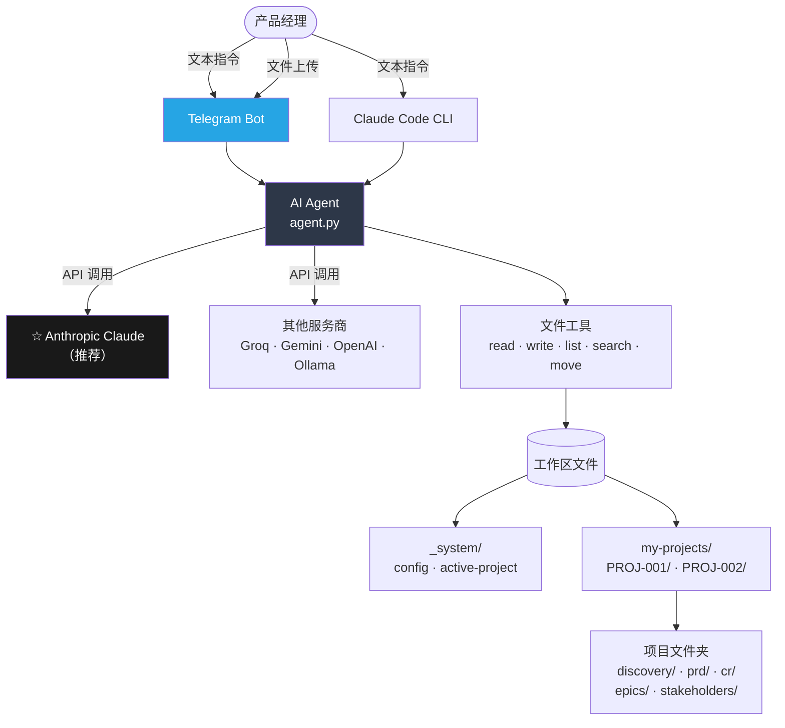
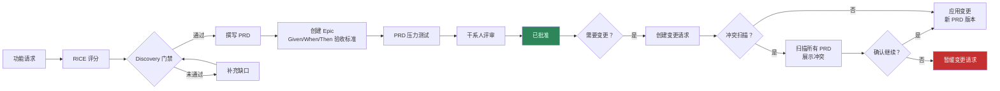

[🇺🇸 English](../README.md)

<p align="center">
  <strong>AI PM Skills</strong>
</p>

<p align="center">
  产品经理 AI 副驾驶 — 功能评分、撰写 PRD、管理 Epic，<br/>
  冲突检测、干系人跟踪。自然语言交互，文件归你掌控。
</p>

<p align="center">
  <a href="https://www.anthropic.com/"></a>
  <a href="https://www.python.org/"></a>
  <a href="https://www.docker.com/"></a>
  <a href="https://telegram.org/"></a>
  
</p>

<p align="center">
  🌐 <strong>语言：</strong>
  <a href="../README.md">🇺🇸 English</a> ·
  <a href="README.fr.md">🇫🇷 Français</a> ·
  <a href="README.ja.md">🇯🇵 日本語</a> ·
  <a href="README.es.md">🇪🇸 Español</a>
</p>

---

## 功能概览

你用自然语言描述需求，AI 负责处理整个产品管理流程 —— 文档生成、版本控制、冲突检查和下一步建议。

| 你说 | 发生什么 |
|------|---------|
| `"Create a new project for checkout redesign"` | 创建完整的项目文件夹，包含 Discovery、PRD、CR、干系人结构 |
| `"Create a feature request for dark mode"` | AI 访谈你，撰写功能请求文档 |
| `"Score FR-001 with RICE"` | AI 提问 4 个问题，用完整公式计算优先级 |
| `"Create PRD for FR-001"` | 撰写完整 PRD，涵盖执行摘要直至团队章节 |
| `"Approve CR-001"` | 执行冲突扫描（可选），创建新 PRD 版本，更新日志 |
| `"Show all projects"` | 列出所有项目及状态，提供快速跳转链接 |
| 发送 `.docx` 或 `.pdf` 文件 | AI 读取并转换至你的工作区 |

---

## 架构设计

### 系统总览



### 产品管理工作流



### 项目文件夹结构

```
my-pm-workspace/
├── my-projects/
│   ├── PROJ-001-ai-alignment/       ← 独立项目文件夹
│   │   ├── PROJECT.md               ← 定义、里程碑、风险
│   │   ├── VERSIONS.md              ← 文档版本审计日志
│   │   ├── discovery/
│   │   │   ├── inbox/               ← FR-001.md, FR-002.md ...
│   │   │   ├── scoring/             ← RICE-001.md ...
│   │   │   ├── research/            ← RS-001.md ...
│   │   │   └── gate/                ← approved / rejected / backlog
│   │   ├── prd/
│   │   │   └── PRD-001-[slug]/
│   │   │       ├── PRD-001-v1.0.md  ← 已批准，不可变
│   │   │       ├── PRD-001-v1.1.md  ← CR 后的新草稿
│   │   │       └── CHANGELOG.md
│   │   ├── epics/                   ← EP-001-v1.0.md（Given/When/Then 验收标准）
│   │   ├── cr/                      ← intake / assessment / approved
│   │   └── stakeholders/            ← SH-001-[name].md
│   └── PROJ-002-checkout/           ← 完全独立
├── _system/
│   ├── config.md                    ← 团队配置
│   └── active-project.md            ← 当前工作项目路径
└── projects-index.md
```

---

## 推荐方案：Anthropic Claude

**Claude 生成的 PRD、Epic 和干系人文档质量最高。** 它能可靠地执行多步骤产品管理工作流，生成结构良好的 Markdown 文档。

获取 API 密钥：**https://console.anthropic.com/settings/keys**

| 模型 | 每 100 万 token 费用 | 适用场景 |
|------|---------------------|---------|
| `claude-sonnet-4-6` | 输入 $3 / 输出 $15 | **日常产品管理工作 — 推荐默认** |
| `claude-opus-4-7` | 输入 $5 / 输出 $25 | 复杂分析、大型 PRD |
| `claude-haiku-4-5` | 输入 $1 / 输出 $5 | 快速查询、简单问题 |

---

## 环境要求

- **编辑器使用：** [Claude Code](https://claude.ai/download)（Claude 的 CLI 工具）
- **Telegram 使用：** Docker + Docker Compose
- Anthropic API 密钥（推荐）或任意支持的服务商密钥

---

## 安装方式

### 方式一 — 编辑器（Claude Code）

```bash
git clone https://github.com/YOUR_USERNAME/aipm_skill_management.git my-pm-workspace
cd my-pm-workspace
bash setup.sh
claude
```

输入：`Create a new project for [your initiative name]`

### 方式二 — Telegram Bot（Docker）

```bash
git clone https://github.com/YOUR_USERNAME/aipm_skill_management.git my-pm-workspace
cd my-pm-workspace
cp .env.example .env
```

编辑 `.env`：
```env
# 推荐：Anthropic Claude
AI_PROVIDER=anthropic
ANTHROPIC_API_KEY=your_key_here
ANTHROPIC_MODEL=claude-sonnet-4-6

# Telegram
TELEGRAM_BOT_TOKEN=your_bot_token
ALLOWED_CHAT_IDS=your_chat_id
```

```bash
make start
```

打开 Telegram → 向你的 Bot 发送消息 → `/start`

---

## 产品管理工作流（逐步说明）

```
第 1 步    "Create a new project for [name]"
           → 项目文件夹创建完成，展示 7 步路线图

第 2 步    "Create a feature request for [description]"
           → AI 访谈你：需求来源、问题、受影响用户

第 3 步    "Score FR-001 with RICE"
           → 4 个问题：覆盖度、影响力、置信度、工作量 → RICE 公式

第 4 步    "Gate review FR-001"
           → 检查 RICE 评分、研究文档、干系人 Sponsor

第 5 步    "Create PRD for FR-001"
           → 完整 PRD：执行摘要 → 团队，附 Epic 索引表

第 6 步    "Create epic for PRD-001: [name]"
           → 完整 Given/When/Then 验收标准（每个用户故事 3+ 场景）

第 7 步    "Grill PRD-001"
           → 压力测试：证据、边界情况、指标、基线

第 8 步    "Submit PRD-001-v1.0 for review" / "Approve PRD-001-v1.0"

第 9 步    "Create CR for PRD-001"
           → AI 询问："是否先运行冲突扫描？是 / 否"
           → 若是：扫描所有 PRD，展示冲突，要求确认
```

---

## 文档版本控制

每份文档遵循不可变快照模型：

```
PRD-001-v1.0.md   ← 已批准（永久锁定）
PRD-001-v1.1.md   ← 已批准（永久锁定）
PRD-001-v2.0.md   ← 当前草稿
```

每个项目中的 `VERSIONS.md` 为审计日志，行记录永不删除。

状态生命周期：`草稿 → 评审中 → 已批准`（或 `已拒绝 → 新草稿`）

---

## 冲突检测

在创建变更请求、更新 PRD 或批准变更时：

```
Bot: 是否在继续之前运行冲突扫描？
     - "是" → 扫描所有 PRD，展示发现结果，要求确认
     - "否"  → 直接继续

--- 若选择"是" ---

冲突扫描：PROJ-001 - AI Alignment
变更：CR-003 — API 合同更新

[警告] 标签冲突：#api-gateway
  PRD-001 和 PRD-002 均涉及该模块。
  PRD-002 团队可能需要更新实现方案。

[警告] 里程碑 M2 存在风险（目标：30/06/2026）
  PRD-002 返工可能导致 M2 延迟 1-2 个 Sprint。

[正常] 无其他 PRD 受影响。
整体风险：中等

是否继续？
- "Yes, proceed" / "No, hold" / "Show PRD-002"
```

Bot 在产品经理确认之前不会写入任何文件。

---

## 文件附件

直接向 Telegram Bot 发送文件：

| 格式 | AI 处理方式 |
|------|------------|
| `.docx` / `.doc` | 读取正文和标题 → 转换为 Markdown |
| `.pdf` | 逐页提取文本 |
| `.xlsx` / `.xls` | 将表格转换为 Markdown |
| `.csv` | 转换为 Markdown 表格 |
| `.md` / `.txt` | 直接读取 |

发送时可添加说明文字，也可不加 —— AI 会主动询问。

---

## Bot 命令

| Make 命令 | 功能说明 |
|----------|---------|
| `make start` | 启动 Telegram Bot |
| `make stop` | 停止 Bot |
| `make restart` | 修改 `.env` 后重启 |
| `make update` | 代码变更后重新构建并重启 |
| `make logs` | 实时查看日志 |
| `make status` | 查看容器健康状态 |

Telegram 命令：`/start` `/help` `/reset`

---

## 内置技能（共 20 项）

| 类别 | 技能 |
|------|------|
| Discovery（需求发现） | create-fr, score-feature, gate-review, deep-research |
| PRD（产品需求文档） | to-prd, manage-epic, conflict-check, grill-prd, update-prd |
| 项目管理 | create-project, find-project, project-status |
| 变更请求 | intake-cr, assess-cr, approve-cr |
| 干系人管理 | add-stakeholder, draft-comms |
| 平台 | setup-workspace, new-sprint, version-doc |

---

## 其他 AI 服务商

| 服务商 | 配置方式 | 费用 | 备注 |
|--------|---------|------|------|
| **Anthropic Claude** | `AI_PROVIDER=anthropic` | $1–$25 / 100 万 token | **推荐** |
| Groq（免费） | `AI_PROVIDER=openai` + Groq base URL | 免费套餐 | 速度快，适合测试 |
| Google Gemini | `AI_PROVIDER=google` | 有免费套餐 | 每分钟 15 次请求限制 |
| OpenAI GPT | `AI_PROVIDER=openai` | $0.15–$10 / 100 万 token | GPT-4o 或 mini |
| Ollama（本地） | `AI_PROVIDER=openai` + localhost URL | 免费 | 需要本地 GPU |

完整配置请参阅 `.env.example`。

---

## 常见问题

**需要技术背景吗？**
不需要。你用自然语言输入，AI 负责所有文件的创建和组织。

**我的数据存储在哪里？**
所有内容以纯 Markdown 文件形式存储在你本机的项目文件夹中。

**多名产品经理可以共享工作区吗？**
可以。通过 Git 或共享磁盘共享文件夹，每位产品经理运行各自的客户端。

**可以手动编辑文件吗？**
可以。所有文件均为纯 Markdown 格式 —— 可在 Obsidian、VS Code、Notion 或任意编辑器中打开。

**指令不起作用怎么办？**
Bot 会根据你的输入和近期操作，推荐最接近的匹配指令。

---

## 参考资料

| 领域 | 参考来源 |
|------|---------|
| 技能格式 | [mattpocock/skills](https://github.com/mattpocock/skills) |
| 功能评分 | [RICE 评分方法](https://www.intercom.com/blog/rice-simple-prioritization-for-product-managers/) — Intercom |
| 产品发现 | [持续发现习惯](https://www.producttalk.org/) — Teresa Torres |
| PRD 规范 | [启示录](https://www.svpg.com/books/inspired-how-to-create-tech-products-customers-love-2nd-edition/) — Marty Cagan |
| 用户故事 | [编写优质用户故事](https://www.mountaingoatsoftware.com/agile/user-stories) — Mike Cohn |
| 决策记录 | [架构决策记录](https://adr.github.io/) |

---

MIT 许可证
